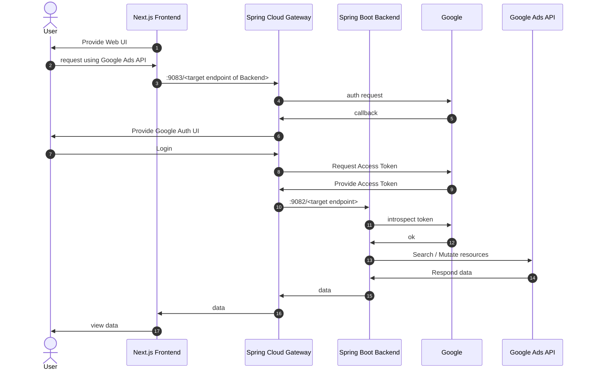

# Google Auth Gateway Example

## How to setup?

- It works by putting the following in the `application-local.yml` of the gateway

```yaml
spring:
  security:
    oauth2:
      client:
        registration:
          google:
            client-id: <Your Google Client ID>
            client-secret: <Your Google Client Secret>
```

## How to work?

- The following figure shows the flow of searching or mutating Google Ads API resources via Google OAuth2.
- By delegating the Google OAuth2 authentication and authorization flow to the [Spring Cloud Gateway](https://spring.io/projects/spring-cloud-gateway), applications can focus on interacting with the Google Ads API
- The following diagram of Spring Cloud Gateway is used as a reference, but the details are omitted
  - https://www.baeldung.com/spring-cloud-gateway-oauth2



## Trial URL

- http://localhost:9083/ads/customers/accessible

## References
- [Using Spring Cloud Gateway with OAuth 2.0 Patterns](https://www.baeldung.com/spring-cloud-gateway-oauth2)
- [Spring Cloud Gatewayでoauth2認証](https://qiita.com/ko-aoki/items/80d5dc8ce678edfa1530)
  - https://github.com/ko-aoki/spring-cloud-sample
